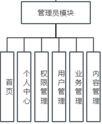
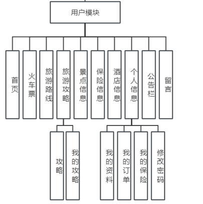
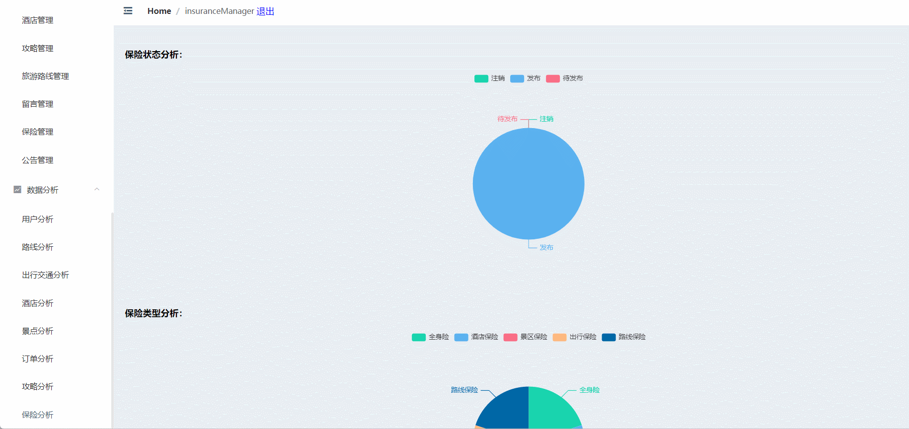
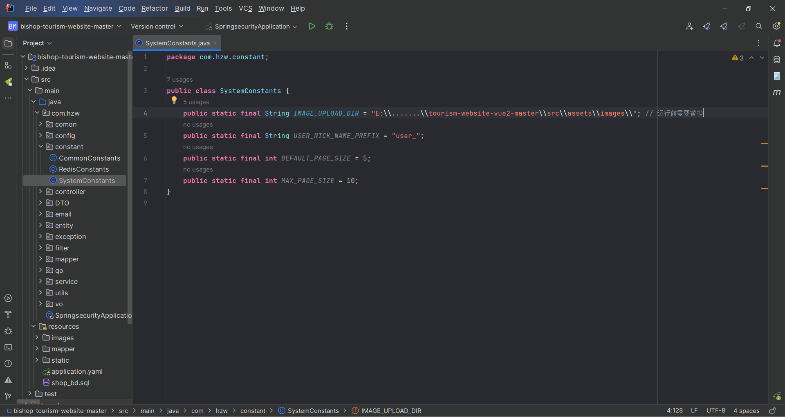
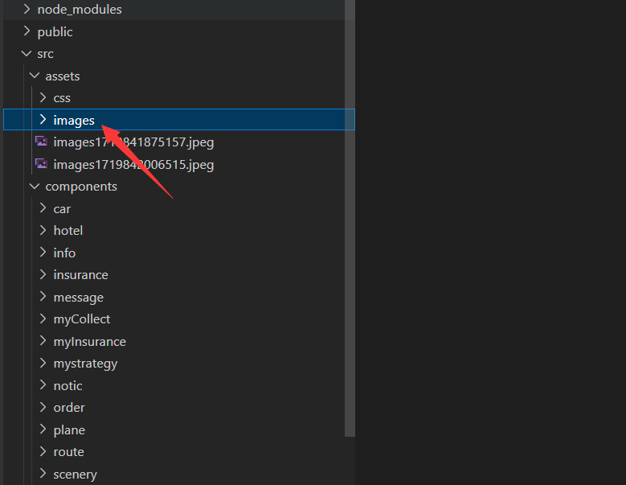

# tour-of-revolution🎂

基于SpringBoot+Vue的红色旅游景点宣传网站

## 介绍🌞

> 本论文论述了如何运用SpringBoot框架和Vue框架编写和创建一个简单、直观的红色旅游网站。网站由系统管理员和普通用户这两部分组成。本文主要讲解了网站的设计与分析、实现与测试。本网站主要包含首页、火车票订购、酒店订购、景区浏览、攻略发布、公告查询、留言、个人信息修改、我的收藏等模块。

## 软件架构🌞





## 项目演示🌞

**用户端**


-----------

**管理端**




## 安装教程🌞

```
1. 运行环境准备mysql8 + java8 + node14.16.1 + redis

2. 配置maven路径，加载依赖

3. 运行sql文件，确保application.yml或config.properties的数据库名称和账号密码是数据库所在主机的账号密码
```


## 使用说明🌞

```
1. 登入

        管理员账号：root 密码：123456

        客户账号：don99 密码：123456
  
2. 运行流程

SpringBoot+Vue项目的部署详情可以查看这篇CSDN博客：http://t.csdnimg.cn/kpuxS

前后端不分离项目的部署流程可以查看这篇CSDN博客：http://t.csdnimg.cn/CslA5
```

本项目需要将下面的路径更换成admin前端“\src\assets\images\”的绝对路径




即下面的绝对路径





## CSDN项目合集🌞

点击前往：http://t.csdnimg.cn/Q4u84


## 联系我🌞

**有偿获取完整源码或调试代码**

🐧：1902317191

wx：coding1902317191


